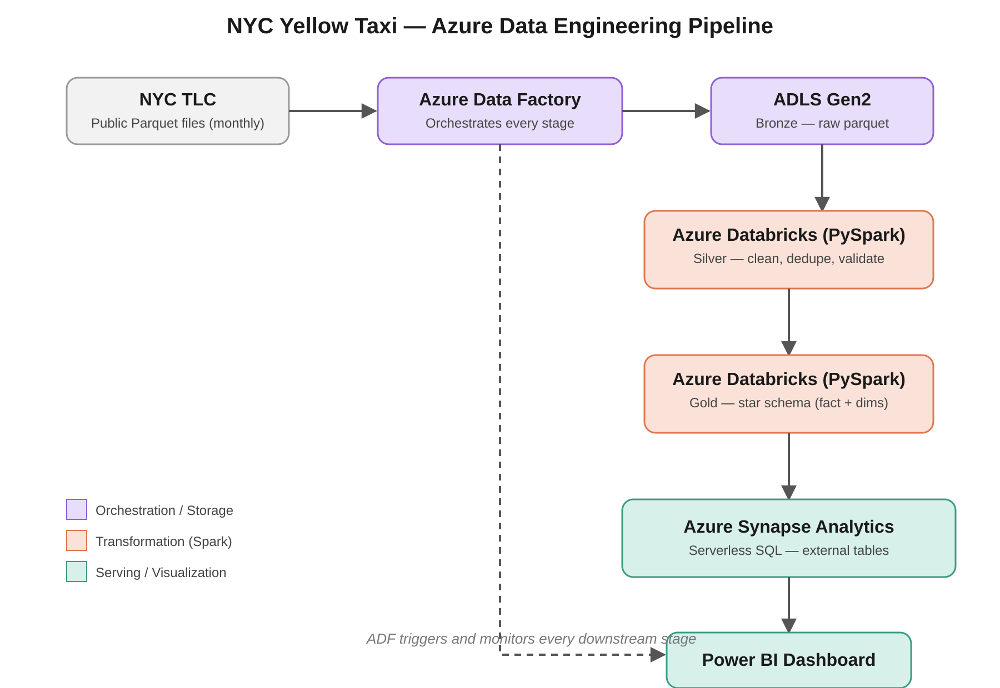

# NYC Yellow Taxi — Azure Data Engineering Pipeline

An end-to-end batch data pipeline that ingests raw NYC TLC taxi trip data, cleans and models it into a star schema, and serves it through a Power BI dashboard — built entirely on Azure.

## Problem Statement

NYC TLC publishes millions of taxi trip records every month as raw Parquet files — not directly usable for reporting or analysis. This project ingests that raw data, cleans and validates it, models it into an analytics-ready star schema, and exposes it through a dashboard answering real business questions: peak demand hours, revenue by pickup zone, monthly trip volume trends, and average trip metrics by payment type.

## Architecture



The pipeline follows a **medallion architecture** (Bronze → Silver → Gold), fully orchestrated by Azure Data Factory:

- **Bronze**: raw Parquet files landed as-is from the public NYC TLC source, unmodified
- **Silver**: cleaned and validated — invalid fares/distances filtered, duplicates removed, trip duration computed
- **Gold**: modeled into a star schema (`fact_trips` + `dim_date`, `dim_location`) ready for BI consumption
- **Serving**: Azure Synapse serverless SQL exposes Gold as queryable external tables, consumed by Power BI

## Tech Stack

Azure Data Factory · Azure Data Lake Storage Gen2 · Azure Databricks (PySpark) · Azure Synapse Analytics (serverless SQL) · Power BI

## Data Source

[NYC TLC Trip Record Data](https://www.nyc.gov/site/tlc/about/tlc-trip-record-data.page) — public, free, monthly Parquet files, no authentication required. Files are fetched directly from TLC's CloudFront distribution (`https://d37ci6vzurychx.cloudfront.net/trip-data/`).

## Pipeline Design

- **Ingestion**: ADF Copy Data pipeline, parameterized with a `year_month_list` array and a `ForEach` loop, so backfilling or extending to new months requires no code changes — just updating the parameter list
- **Transformation**: two Databricks PySpark notebooks (`bronze_silver`, `silver_gold`), triggered as Databricks job activities chained inside the same ADF pipeline, so the entire flow runs from a single trigger
- **Modeling**: star schema chosen over a normalized model specifically for BI query performance — fewer joins for Power BI to resolve at query time
- **Serving**: Synapse serverless SQL pool (pay-per-query, zero idle cost) rather than a dedicated pool, appropriate for this project's query volume

## Key Design Decisions

- **Parameterized ADF pipeline** with a `ForEach` loop instead of one hardcoded Copy Data activity per year-month — trivially extensible to new months or a full historical backfill
- **Star schema** over 3NF normalization — this is an analytical workload, not transactional, so denormalizing for query speed is the right trade-off
- **Serverless Synapse SQL** over a dedicated pool — avoids always-on compute cost for a reporting workload that isn't under constant heavy concurrent load
- **Explicit schema validation** at the Bronze-to-Silver boundary rather than relying on schema inference — TLC has changed its schema before (e.g., adding `congestion_surcharge`, `airport_fee`), so failing loudly on unexpected schema drift beats silently processing bad data

## What I'd Do Differently at Scale

- Move from plain Parquet to **Delta Lake** for ACID transactions, schema evolution (`mergeSchema`), and time travel — would have made iterative development safer and is the more production-realistic choice
- Add **Great Expectations** for declarative, auditable data quality checks instead of inline PySpark filter/assert logic
- Replace full-overwrite writes in the Gold layer with **incremental/merge-based loading** if this needed to run daily instead of monthly
- Add **CI/CD** (Azure DevOps or GitHub Actions) to deploy ADF pipeline definitions and Databricks notebooks automatically, instead of manual Publish/Export
- Partition the Gold `fact_trips` table by pickup date to enable partition pruning as data volume grows

## Dashboard


*(Add your actual Power BI screenshots here once built — trips-by-hour heatmap, revenue by pickup zone, monthly trend line, average tip % by payment type.)*

## Repository Structure

```
nyc-taxi-azure-data-engineering/
├── README.md
├── architecture/
│   └── architecture_diagram.png
├── notebooks/
│   ├── bronze_silver.py
│   └── silver_gold.py
├── sql/
│   └── synapse_external_tables.sql
└── dashboard/
    └── screenshots/
```

## How to Run

1. Deploy the Azure resources: resource group, ADLS Gen2 (bronze/silver/gold containers), Azure Data Factory, Azure Databricks, Azure Synapse Analytics
2. Import `notebooks/01_bronze_to_silver.py` and `notebooks/02_silver_to_gold.py` into your Databricks workspace
3. In ADF, recreate the linked services and the parameterized `pl_ingest_yellow_taxi` pipeline (source HTTP → Bronze, then Databricks Notebook activities for Silver and Gold)
4. Run `sql/synapse_external_tables.sql` in Synapse Studio against the serverless SQL pool to expose the Gold tables
5. Connect Power BI Desktop to the Synapse serverless SQL endpoint and build visuals against `fact_trips`, `dim_date`, `dim_location`

## Author's Note

This is a personal portfolio project built end-to-end to demonstrate hands-on Azure data engineering skills — ingestion orchestration, Spark-based transformation, dimensional modeling, and BI serving — using a genuinely large, real public dataset rather than a toy CSV.
